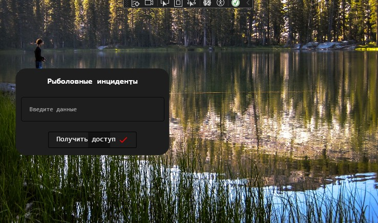
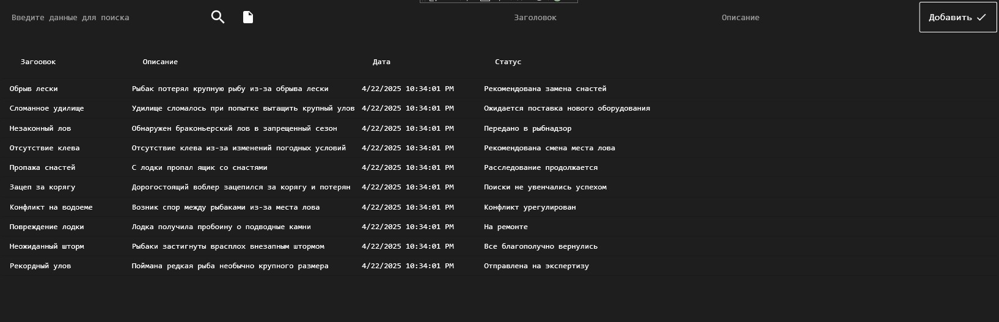

<h1 align="center">Задание 12. Система управления инцидентами</h1>

  

    WPF-приложение для учета и обработки происшествий с функциями:
    <ul>
      <li>Создание новых инцидентов</li>
      <li>Редактирование существующих записей</li>
      <li>Классификация и категоризация происшествий</li>
      <li>Отслеживание статуса обработки</li>
    </ul>
  

  
   

